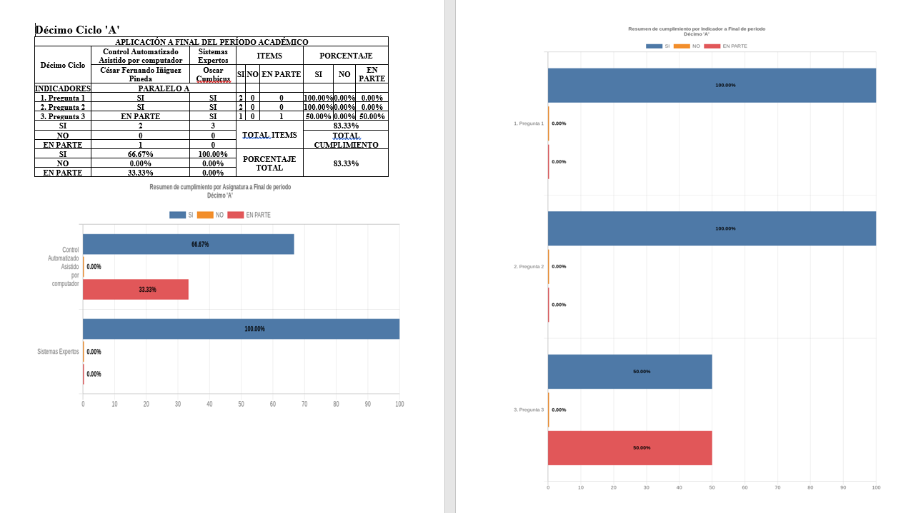

<h1 align="center">
   
  
   
  Seguimiento al sílabo y Plan de mejoras (SSPM).
   
</h1>

## Table of Contents

- [Description](#description)
- [Integrants](#integrants)
- [Documentation](#documentation)
- [License](#license-📘&nbsp;)

## Description:

Final degree work focused on the development of a module for the process "Seguimiento al sílabo y Plan de mejoras" at the "Universidad Nacional de Loja"

This repository contains source code to generate .docx report about rated syllabus sheets. The technology used in this project is NodeJS.

Example of Generated doc.

## Integrants:

This Project was carried out by:

  

    | <a href="https://github.com/jcalarcon98"> <b>Jean Carlos Alarcón O.</b></a>
  

  
  

    | <a href="https://github.com/EdansRocks"> <b>Edgar Andrés Soto R.</b></a>
  

## Documentation

You can see the documentation of this project in the next link: [Backend SSPM Documentation](https://jcalarcon98.github.io/SSPM-BACKEND/).

Also, you can access to the END POINTS documentation in the next link: [END POINT Documentation](https://documenter.getpostman.com/view/10762142/TW77f2yK#3352d860-1e9b-448a-979d-ca3b8c6ec28c) 
## License 📘

SSPM module is under terms of the [MIT License](LICENSE).